## 运行LiteOS onelight demo

* [1.获取源代码](#1)
* [2.Huawei LiteOS目录介绍](#2)
* [3.开发板硬件连接](#3)
* [4.打开MDK523项目](#4)
* [5.编译工程](#5)
* [6.下载运行](#6)
* [7.LOG打印输出](#7)
* [8.查看OceanConnect平台数据](#8)
* [9.OceanConnect下发命令](#9)


<h3 id="1">1.获取源代码</h3>

	华为IoT开发者生态峰会LiteOS_NB-IoT_OceanConnect
	链接：https://pan.baidu.com/s/1bIo0hkfgy_KWQx_Xi_BX3Q 
	密码：lyyh
	【注意】下载源代码，安装MDK523，安装STLINK驱动，安装CH340驱动等。

<h3 id="2">2.Huawei LiteOS目录介绍</h3>

```C
.
├── arch
│   ├── arm
│   └── msp430
├── build
│   └── Makefile
├── components
│   ├── connectivity
│   ├── fs
│   ├── lib
│   ├── log
│   ├── net
│   ├── ota
│   └── security
├── demos
│   ├── agenttiny_lwm2m
│   ├── agenttiny_mqtt
│   ├── dtls_server
│   ├── fs
│   ├── kernel
│   └── nbiot_without_atiny
├── doc
│   ├── Huawei_LiteOS_Developer_Guide_en.md
│   ├── Huawei_LiteOS_Developer_Guide_zh.md
│   ├── Huawei_LiteOS_SDK_Developer_Guide.md
│   ├── LiteOS_Code_Info.md
│   ├── LiteOS_Commit_Message.md
│   ├── LiteOS_Contribute_Guide_GitGUI.md
│   ├── LiteOS_Supported_board_list.md
│   └── meta
├── include
│   ├── at_device
│   ├── at_frame
│   ├── atiny_error.h
│   ├── atiny_lwm2m
│   ├── atiny_mqtt
│   ├── fs
│   ├── log
│   ├── nb_iot
│   ├── osdepends
│   ├── ota
│   ├── sal
│   └── sota
├── kernel
│   ├── base
│   ├── extended
│   ├── include
│   ├── los_init.c
│   └── Makefile
├── LICENSE
├── osdepends
│   └── liteos
├── README.md
├── targets
│   ├── STM32L431CBxx_EVB_L1_Light
│   └── STM32L431RxTx_EVB_M1_Light
└── tests
    ├── cmockery
    ├── test_agenttiny
    ├── test_main.c
    ├── test_sota
    └── test_suit

```

<h3 id="3">3.开发板硬件连接</h3>

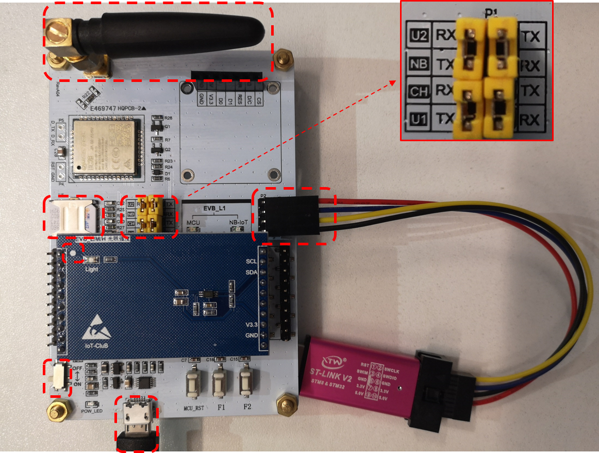

- 注意P1短接端子的短接方式。

<h3 id="4">4.打开MDK523项目</h3>

- 进入targets\STM32L431CBxx_EVB_L1_Light\MDK-ARM，打开STM32L431CBxx.uvprojx

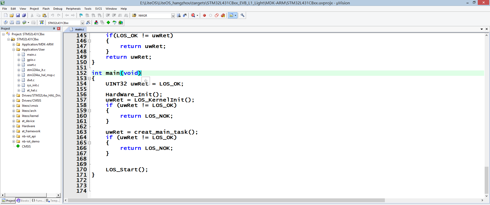

<h3 id="5">5.编译工程</h3>

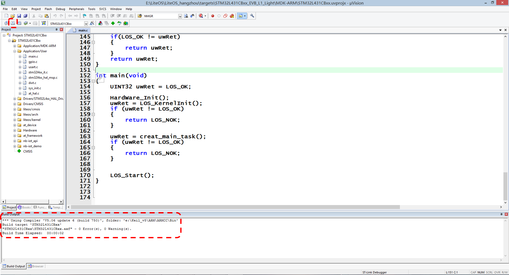

<h3 id="6">6.下载运行</h3>

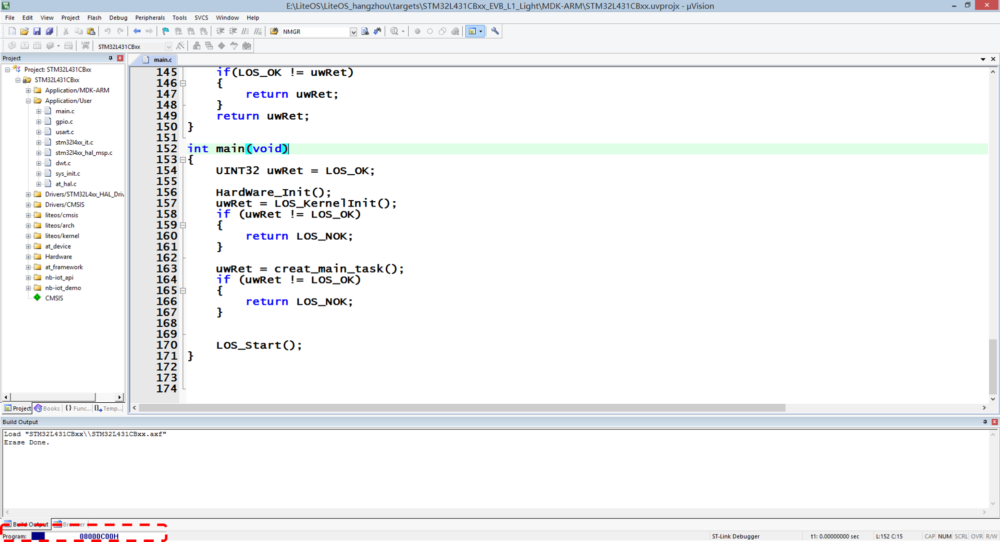

- 【注意】下面的工程设置参数。

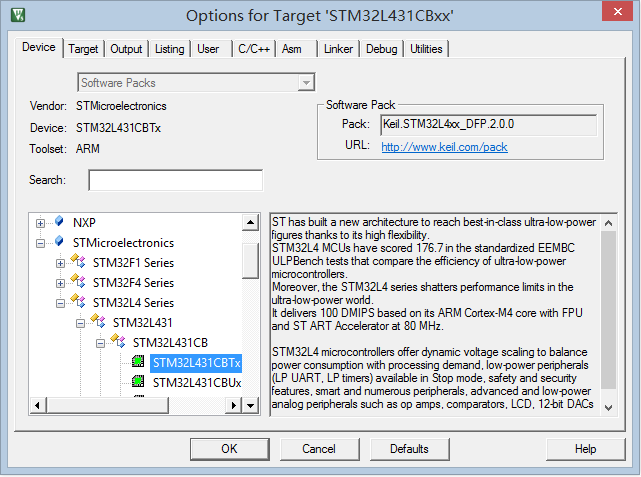

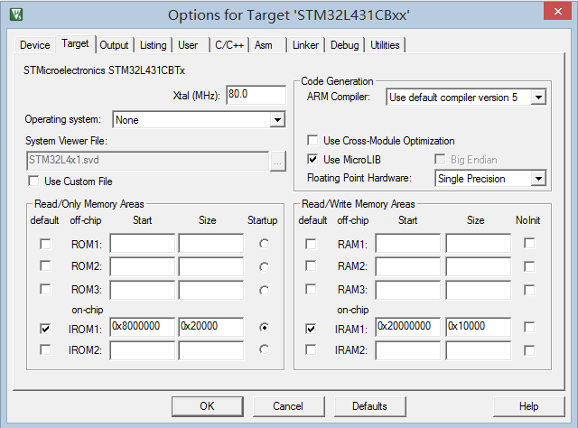

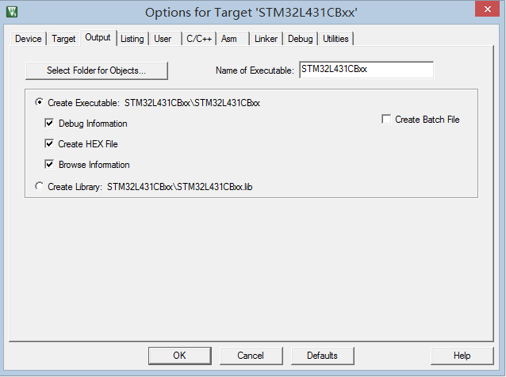

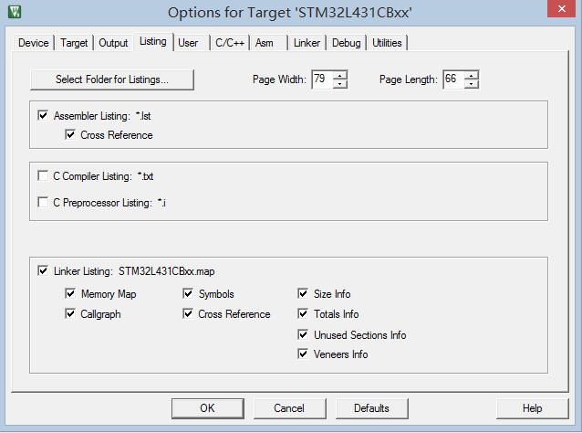

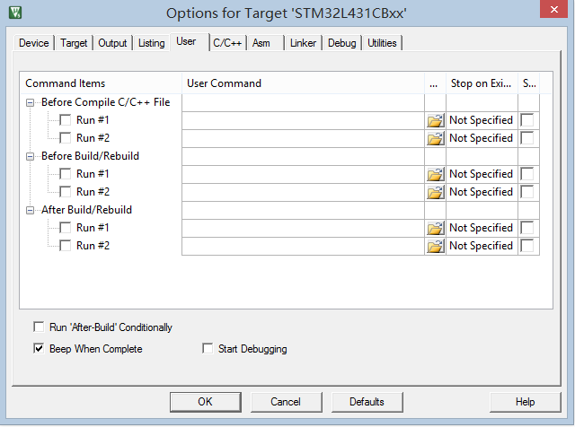

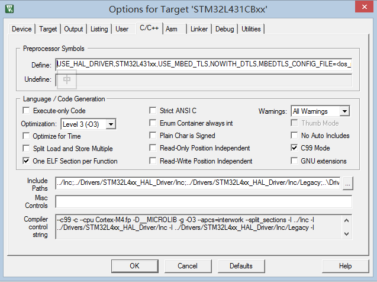

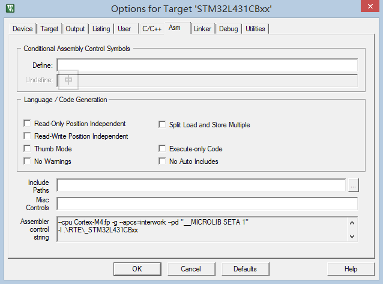

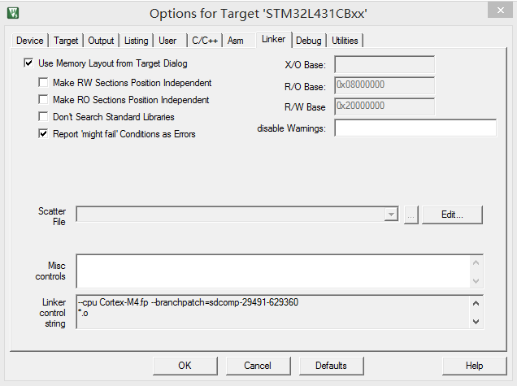

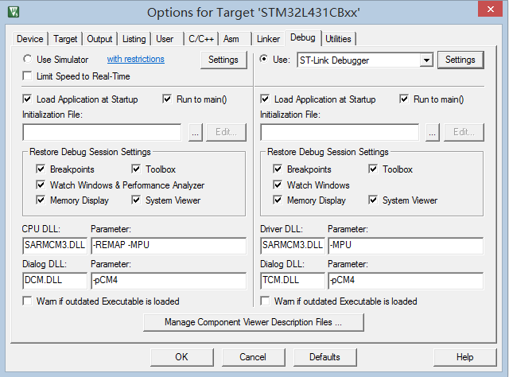

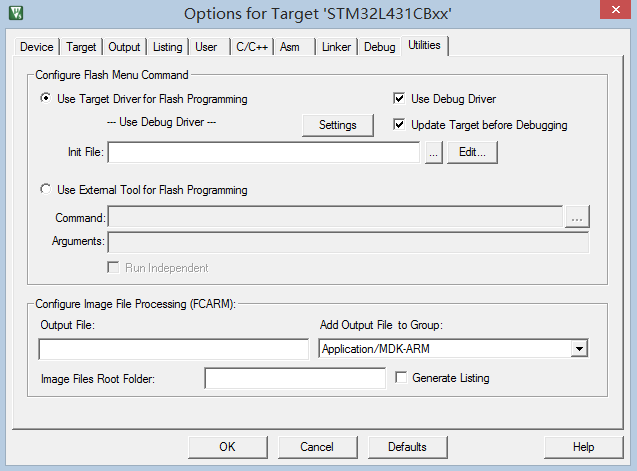

<h3 id="7">7.LOG打印输出</h3>

- 先登陆OceanConnect平台。


- 【注意】此时串口调试助手，已经开始打印输出的LOG信息。串口波特率要选择115200，因为串口日志是通过USART1来打印的，而程序中将USART1的波特率设为了115200。对应的数据可以在OC平台上查看。

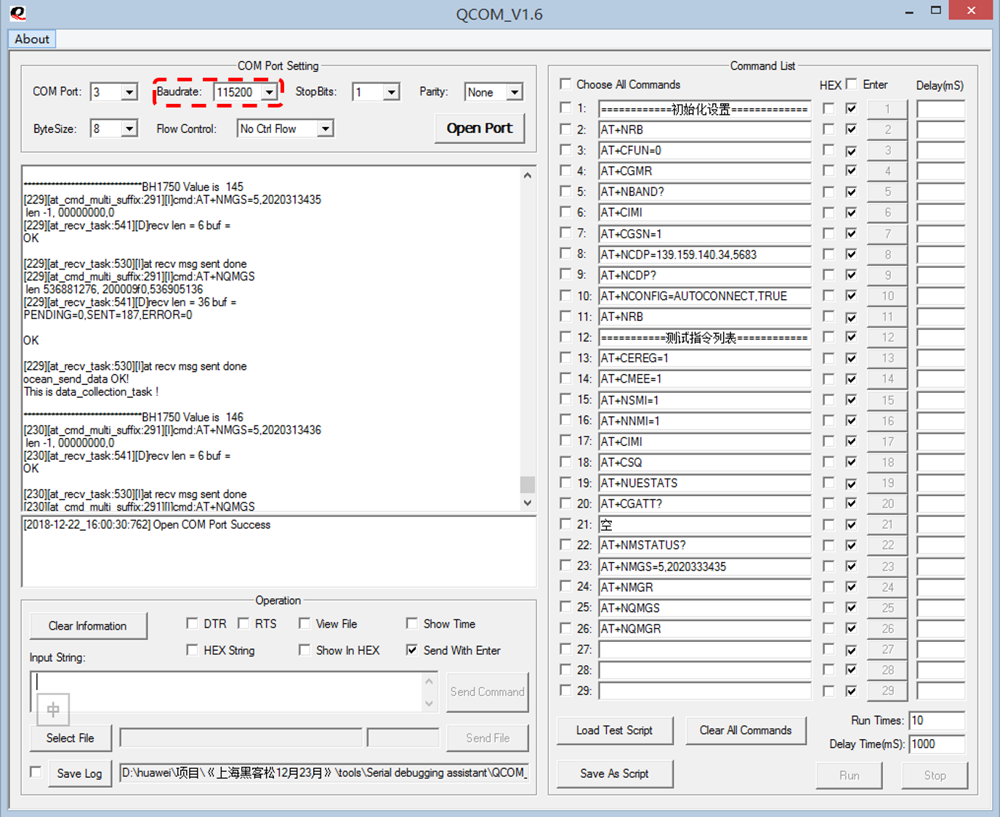

<h3 id="8">8.查看OceanConnect平台数据</h3>


<h3 id="9">9.OceanConnect下发命令</h3>


- 至此，完成LiteOS调测OneLight。

附：
此次LiteOS提供的4合1 Demo，其中包括 OneButton, OneSmoke, OneGPS, OneLight。
可以根据下面的宏定义，选择合适的传感器，即可完成Demo的调测。


